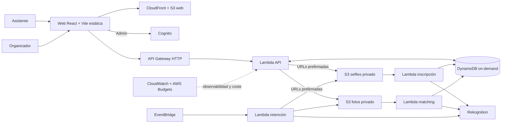

# Findly

Findly es el proyecto final del Postgrado en Cloud Computing Architecture de la UPC. Permite a asistentes de un evento inscribirse con consentimiento explícito y una selfie, localizar coincidencias en fotografías de evento y recibir una galería privada de duración limitada.

## Alcance del MVP

El MVP usa únicamente imágenes sintéticas o autorizadas y consentimiento biométrico explícito. Excluye vigilancia o vídeo en tiempo real, tratamiento de datos de menores, alta disponibilidad o despliegue multirregión, RDS, EC2, VPC, NAT, EKS, notificaciones masivas por correo/SMS y otros servicios persistentes de coste fijo.

## Flujo del MVP

1. El asistente acepta el consentimiento biométrico y carga una selfie mediante una URL prefirmada.
2. Una Lambda indexa el rostro en Amazon Rekognition y actualiza el estado de inscripción.
3. El organizador autenticado carga fotos del evento; una Lambda busca coincidencias.
4. Findly crea una galería temporal con URLs S3 prefirmadas y permite retirar los datos.

## Arquitectura



## Stack y recursos AWS

| Dominio                    | Tecnologías y recursos                                                         |
| -------------------------- | ------------------------------------------------------------------------------ |
| Frontend y distribución    | React con Vite, TypeScript, Amazon S3 para la web y Amazon CloudFront.         |
| Seguridad e identidad      | Amazon Cognito para autenticar a los organizadores.                            |
| API y procesamiento        | Amazon API Gateway HTTP y funciones AWS Lambda con Node.js 22.                 |
| Datos, imágenes y matching | Amazon DynamoDB on-demand, buckets privados de Amazon S3 y Amazon Rekognition. |
| Automatización y retención | Amazon EventBridge Scheduler y Lambda de retención.                            |
| Observabilidad y FinOps    | Amazon CloudWatch y AWS Budgets.                                               |
| Infraestructura y entrega  | Terraform y GitHub Actions.                                                    |

No se usan RDS, NAT, VPC, EKS ni servicios persistentes de coste fijo.

## Desarrollo local de la galería

La galería privada puede ejecutarse sin una cuenta AWS mediante [Floci](https://floci.io/), Docker Compose y el SDK oficial de AWS apuntando al endpoint local:

```sh
docker compose up -d floci
docker compose run --rm local-seed
docker compose up local-api
VITE_API_BASE_URL=http://localhost:8787 npm run dev
```

Abre `/gallery?token=demo-gallery`. El seeder usa únicamente datos sintéticos y el mock sigue disponible si `VITE_API_BASE_URL` está vacío. La integración gestionada con AWS y Terraform queda fuera del alcance actual.

La consola opcional de Floci se abre visitando `http://localhost:4566/_floci/ui`; la imagen necesita el socket Docker montado para crear su contenedor sidecar y queda disponible en `http://localhost:4500/console/aws`.

Los recursos se etiquetan con `Project`, `Environment`, `ManagedBy`, `CostCenter` y `DataClass`. Los datos de demostración tienen retención configurable, el valor inicial es siete días y los buckets nunca permiten acceso público.

## Siguiente paso

La implementación se distribuye mediante las issues derivadas de [`specs/`](/Users/anyulled/IdeaProjects/findly/specs/README.md). La primera entrega de código deberá añadir la herramienta de construcción y los comandos de validación definidos en la issue de fundación.

## Operación y CI/CD

GitHub Actions valida commits convencionales, Markdown y workflows. Los workflows de despliegue y limpieza cada 12 horas son handoffs seguros: no ejecutan AWS hasta que el equipo de plataforma implemente y revise las correspondientes specs.

## Participantes del equipo

| Participante              |
| ------------------------- |
| Anyul Rivas               |
| Renato Luzuriaga          |
| Martí Fabregat Pous       |
| Santiago Oliver Surinyach |

La memoria, ADRs, evidencias y backlog publicable viven en [`docs/`](/Users/anyulled/IdeaProjects/findly/docs/README.md) y [`specs/`](/Users/anyulled/IdeaProjects/findly/specs/README.md).
