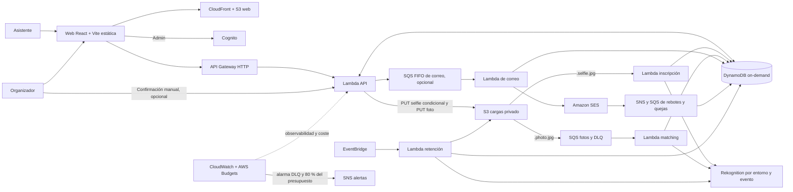

# Findly

Findly es el proyecto final del Postgrado en Cloud Computing Architecture de la UPC. Permite a asistentes de un evento inscribirse con consentimiento explícito y una selfie, localizar coincidencias en fotografías de evento y recibir una galería privada de duración limitada.

## Alcance del MVP

El MVP usa únicamente imágenes sintéticas o autorizadas y consentimiento biométrico explícito. Excluye vigilancia o vídeo en tiempo real, tratamiento de datos de menores, alta disponibilidad o despliegue multirregión, RDS, EC2, VPC, NAT, EKS, campañas de correo, SMS y envíos ajenos a galerías del evento y otros servicios persistentes de coste fijo.

## Flujo del MVP

1. El asistente acepta el consentimiento biométrico y carga una selfie mediante una URL prefirmada.
2. Una Lambda indexa el rostro en Amazon Rekognition y actualiza el estado de inscripción.
3. El organizador autenticado carga fotos del evento; una Lambda busca coincidencias.
4. Findly crea una galería temporal con URLs S3 prefirmadas y permite retirar los datos.
5. Con SES configurado, el organizador confirma el envío manual de enlaces a participantes elegibles.

## Cómo ver la aplicación funcionando

Tres formas de ejecutar Findly, de menos a más real, todas documentadas paso
a paso con comandos exactos:

| Modo                   | Qué necesitas         | Qué prueba                                                                           | Guía                                                                                                                                                     |
| ---------------------- | --------------------- | ------------------------------------------------------------------------------------ | -------------------------------------------------------------------------------------------------------------------------------------------------------- |
| Mock (en el navegador) | Sólo `npm ci`         | Sólo la interfaz; nada de backend real.                                              | `npm run dev:mocks` ([modos de ejecución](docs/execution-modes.md))                                                                                      |
| Local con Floci        | Docker Compose        | Los mismos handlers Lambda contra DynamoDB/S3 emulados.                              | `npm run dev:floci` ([modos de ejecución](docs/execution-modes.md))                                                                                      |
| AWS real (`sandbox`)   | Una cuenta AWS propia | El backend real: DynamoDB, S3, Rekognition, Cognito, API Gateway y Lambda de verdad. | [`docs/runbooks/aws-deployment-guide.md`](docs/runbooks/aws-deployment-guide.md) — guía completa, comando a comando, desde cero hasta una demo navegable |

La guía de despliegue en AWS incluye el recorrido manual completo (crear un
evento, inscribirte con una selfie, ver la galería, ejercer el derecho al
olvido) y una tabla de solución de problemas. `docs/runbooks/demo-runbook.md`
resume los cuatro niveles disponibles (local, AWS efímero de CI, AWS
`sandbox` propio, `demo`/`production` publicado) y cuál está bloqueado hoy y
por qué.

## Arquitectura


```mermaid
flowchart LR
  A[Asistente] --> W[Web React + Vite estática]
  O[Organizador] --> W
  W --> CF[CloudFront + S3 web]
  W -->|Admin| C[Cognito]
  W --> G[API Gateway HTTP]
  G --> API[Lambda API]
  API <--> D[(DynamoDB on-demand)]
  API -->|PUT selfie condicional y PUT foto| S[S3 cargas privado]
  S -->|.selfie.jpg| E[Lambda inscripción]
  E --> R[Rekognition por entorno y evento]
  S -->|.photo.jpg| Q[SQS fotos y DLQ]
  Q --> M[Lambda matching]
  M --> R
  E --> D
  M --> D
  O -->|Confirmación manual, opcional| API
  API --> EQ[SQS FIFO de correo, opcional]
  EQ --> EM[Lambda de correo]
  EM --> D
  EM --> SES[Amazon SES]
  SES --> EF[SNS y SQS de rebotes y quejas]
  EF --> D
  EB[EventBridge] --> X[Lambda retención]
  X --> S
  X --> D
  X --> R
  CW[CloudWatch + AWS Budgets] -. observabilidad y coste .-> API
  CW -->|alarma DLQ y 80 % del presupuesto| SNS[SNS alertas]
```

## Stack y recursos AWS

| Dominio                    | Tecnologías y recursos                                                         |
| -------------------------- | ------------------------------------------------------------------------------ |
| Frontend y distribución    | React con Vite, TypeScript, Amazon S3 para la web y Amazon CloudFront.         |
| Seguridad e identidad      | Amazon Cognito para autenticar a los organizadores.                            |
| API y procesamiento        | Amazon API Gateway HTTP y funciones AWS Lambda con Node.js 24.                 |
| Datos, imágenes y matching | Amazon DynamoDB on-demand, buckets privados de Amazon S3 y Amazon Rekognition. |
| Automatización y retención | Amazon EventBridge Scheduler y Lambda de retención.                            |
| Observabilidad y FinOps    | Amazon CloudWatch, Amazon SNS y AWS Budgets.                                   |
| Infraestructura y entrega  | Terraform y GitHub Actions.                                                    |

No se usan RDS, NAT, VPC, EKS ni servicios persistentes de coste fijo.

## Desarrollo local de la galería

La galería privada puede ejecutarse sin una cuenta AWS mediante [Floci](https://floci.io/), Docker Compose y el SDK oficial de AWS apuntando al endpoint local. Consulta los [modos de ejecución](docs/execution-modes.md) para distinguir mocks, Floci y el sandbox AWS:

```sh
docker compose up -d floci
docker compose run --rm local-seed
docker compose up local-api
VITE_API_BASE_URL=http://localhost:8787 npm run dev
```

Abre `/gallery?token=demo-gallery`. El seeder usa únicamente datos sintéticos y el mock sigue disponible si `VITE_API_BASE_URL` está vacío. El root Terraform declara la base compartida de DynamoDB, S3 y API Gateway, además de `GalleryReader` y su ruta pública `GET /gallery`; no se aplica desde desarrollo local. Las rutas administrativas permanecen en la issue #5.

La consola opcional de Floci se abre visitando `http://localhost:4566/_floci/ui`; la imagen necesita el socket Docker montado para crear su contenedor sidecar y queda disponible en `http://localhost:4500/console/aws`.

## Infraestructura y estado Terraform

`infra/modules/` contiene los módulos reutilizables (`findly-stack` compone el
stack) y `infra/environments/{sandbox,demo,production}` son raíces finas, cada
una con su propia clave de estado `findly/<entorno>/terraform.tfstate` en un
bucket S3 cifrado y versionado creado por `infra/bootstrap`. El bloqueo usa el
lockfile nativo de S3 ([ADR-009](docs/adr/ADR-009-terraform-remote-state-and-environment-isolation.md)).
Consulta el [runbook](docs/runbooks/terraform-remote-state.md).

## Administración de eventos

El área `/admin/login` usa Cognito `USER_PASSWORD_AUTH`, sin secretos de
cliente ni persistencia de token. Para una compilación gestionada se requieren
los valores públicos `VITE_COGNITO_USER_POOL_ID`, `VITE_COGNITO_CLIENT_ID`,
`VITE_COGNITO_REGION` y `VITE_API_BASE_URL`; `.env.example` contiene los
nombres, no valores sensibles. La raíz Terraform expone los tres valores de
Cognito que se inyectan durante la compilación. Sin ellos, el acceso
administrativo falla de forma segura.

Los recursos se etiquetan con `Project`, `Environment`, `ManagedBy`, `CostCenter` y `DataClass`. Los datos de demostración tienen retención configurable, el valor inicial es siete días y los buckets nunca permiten acceso público.

## Siguiente paso

La implementación se distribuye mediante las issues derivadas de [`specs/`](/Users/anyulled/IdeaProjects/findly/specs/README.md). La primera entrega de código deberá añadir la herramienta de construcción y los comandos de validación definidos en la issue de fundación.

## Operación y CI/CD

GitHub Actions valida commits convencionales, Markdown y workflows. Para cada
pull request interno no draft, el workflow de entorno efímero crea un stack
Terraform identificado por PR, prueba con datos sintéticos el API, Cognito y S3
realmente desplegados, y destruye el stack aun cuando la prueba falla. El
recorrido Playwright-Floci local permanece en el job E2E independiente; sus
navegadores se restauran de caché por SO y lockfile. La cuenta AWS y las
variables GitHub requeridas se configuran siguiendo el
[runbook externo](docs/runbooks/ephemeral-pr-ci-external-setup.md); no se usan
claves AWS de larga duración ni `terraform apply` desde desarrollo local.
Los permisos adicionales del rol se versionan en
[`infra/iam/ephemeral-pr-extensions.json`](infra/iam/ephemeral-pr-extensions.json)
y sirven a todos los recursos `findly-pr-*`, sin políticas nuevas por PR.

### Observabilidad y FinOps

Las Lambdas escriben logs JSON con `correlationId` y una lista cerrada de
metadatos, sin datos personales; los grupos de logs conservan 14 días. La alarma
de la DLQ de fotos y un presupuesto que avisa al 80 % de 5 USD publican en un
topic SNS. El correo de destino se pasa al aplicar con `TF_VAR_alert_email` y
nunca se versiona; el destinatario debe confirmar la suscripción de AWS. Detalle
y límites de validación en
[`docs/evidence/issue-13-observability-finops.md`](docs/evidence/issue-13-observability-finops.md).

## Participantes del equipo

| Participante              |
| ------------------------- |
| Anyul Rivas               |
| Renato Luzuriaga          |
| Martí Fabregat Pous       |
| Santiago Oliver Surinyach |

La memoria, ADRs, evidencias y backlog publicable viven en [`docs/`](/Users/anyulled/IdeaProjects/findly/docs/README.md) y [`specs/`](/Users/anyulled/IdeaProjects/findly/specs/README.md).

## Verificación pendiente y trazabilidad

La [auditoría de cierres #70](docs/evidence/issue-checklist-audit.md) distingue
frontend simulado, Floci y evidencia AWS. Las issues #6, #8, #10, #13 y #22
conservan su historial de verificación; #6 y #8 ya se cerraron con evidencia
AWS. La demo publicada y las cinco series de errores de #22 se verificaron
en el [run 37198156959](https://github.com/upc-malvaviscos/findly/actions/runs/37198156959).
El ciclo manual y la conservación del backend están documentados en
[la evidencia posterior a PR #93](docs/evidence/2026-10-04-pr-93-demo-acceptance.md).
Las issues #10 y #13 mantienen sus criterios propios pendientes. `npm run verify`
valida gates locales; Playwright se ejecuta con `npm run test:e2e` y
`npm run test:e2e:local`. Un merge o una suite mock verde no acredita demo AWS.

La continuación aprobada de #70 añade referencias de limpieza sin TTL
([ADR-013](docs/adr/ADR-013-durable-registration-cleanup.md)), selfies de una
sola escritura ([ADR-014](docs/adr/ADR-014-immutable-selfie-uploads.md)) y
colecciones separadas por entorno
([ADR-015](docs/adr/ADR-015-environment-scoped-rekognition-collections.md)).
Los identificadores de rostro de limpieza siguen siendo datos sensibles.
Los ADRs describen compatibilidad, reintentos y límites; la validación AWS y
la migración de colecciones antiguas requieren evidencia propia.

## Envío manual de galerías (issue #86)

Las nuevas inscripciones requieren email. El organizador puede solicitar un
correo individual a los participantes vigentes con fotos mediante un botón por
evento y confirmación; el matching no envía correo automáticamente. Se muestra
progreso, omisiones, aceptación SES (no entrega), fallos e incertidumbre.
Inscripciones antiguas sin email conservan sus galerías.

Producción permite publicar web y backend con `enable_production_email=false`.
Para activar el envío, ejecutar el despliegue con `enable_production_email=true`
tras verificar SES; el build recibe `VITE_GALLERY_EMAIL_ENABLED` con el mismo
valor y oculta el control de envío cuando está deshabilitado.

El módulo de correo se habilita por entorno con identidad SES verificada,
remitente y origen HTTPS propio. Está desactivado por defecto; SES/DNS Acens y
entregabilidad real quedan pendientes. Diseño aprobado en
[ADR-019](docs/adr/ADR-019-manual-gallery-email-capabilities.md), configuración en
[runbook SES](docs/runbooks/gallery-email-ses-acens.md) y pruebas/pendientes en
[evidencia #86](docs/evidence/issue-86-gallery-email.md). La issue #49 permanece
abierta.
