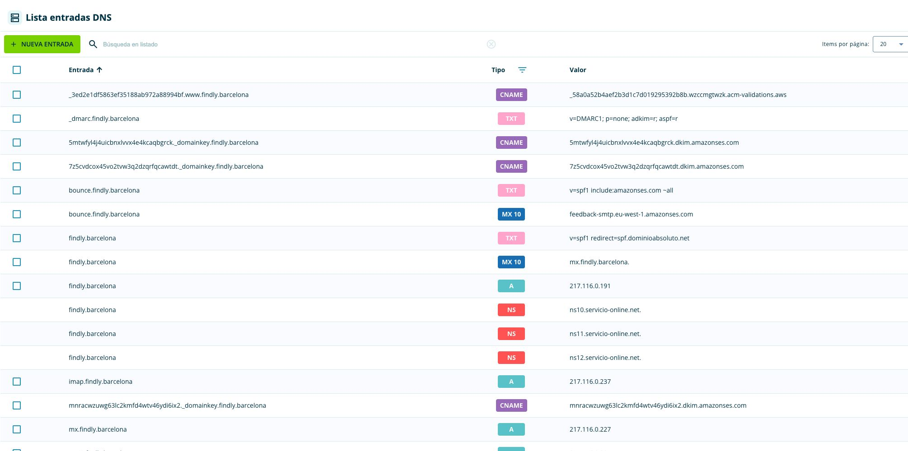
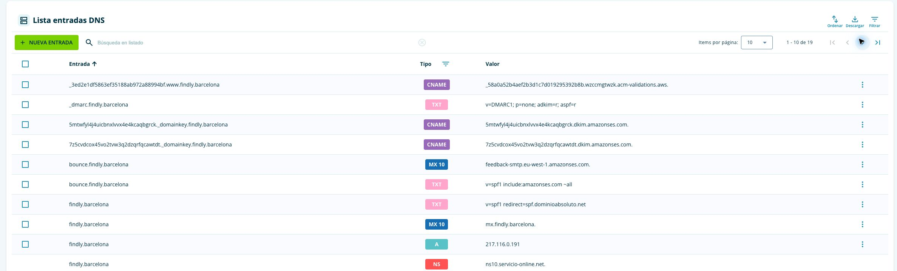

# Issue #98: configuración SES y preparación de producción

<!-- requirement: REQ-PRODUCTION-DOMAIN -->

## Alcance y autorización — 2026-10-04

Seguimiento de #86, spec 20 y ADR-019/ADR-020. El responsable autorizó el plan,
dos buzones de proveedores distintos (direcciones excluidas de esta evidencia),
DNS en Acens, aplicación en `www.findly.barcelona` y creación puntual de roles
limitados con la sesión administrativa existente. #49 permanece abierta.

## Estado comprobado

- PR #97 integrada; sus pruebas efímeras no habilitaron SES ni prueban recepción.
- SES eu-west-1 permanece en sandbox: 200 mensajes/día, 1 por segundo;
  identidad creada por OIDC; acceso aún no solicitado mientras se valida DNS.
- Acens mantiene DNS/MX/SPF del dominio raíz. DMARC de observación se guardó
  en su panel: `v=DMARC1; p=none; adkim=r; aspf=r`; publicación comprobada
  en `ns11.servicio-online.net`. Los tres CNAME DKIM, MX/TXT MAIL FROM y
  CNAME ACM están guardados en Acens y comprobados sin recursión en los
  tres servidores autoritativos. Algunas respuestas negativas previas continúan
  en caché. La comprobación posterior confirmó identidad verificada y DKIM
  SUCCESS; MAIL FROM sigue PENDING.
- Entorno GitHub `production` creado, limitado a la rama `main`; variables
  públicas de cuenta, bucket existente y rol compartido configuradas.
- Rol `findly-shared-config` creado y corregido a confianza GitHub OIDC exacta.
  AWS Access Analyzer validó los permisos sin findings. El verificador
  `scripts/check-shared-config-permissions.mjs` pasó ocho comprobaciones AWS
  IAM Simulator: estado propio permitido; envío, IAM, estado de producción,
  borrado del estado y reetiquetado de certificados ajenos rechazados.
- La sesión raíz no puede asumir roles: AWS respondió que no se permite.
  No se ha aplicado Terraform ni desplegado recursos de correo/web como raíz.

## Validación y pendientes

La primera entrega añade el workflow manual compartido, comprobaciones previas
a credenciales y certificado reproducible. `npm run verify` completado:
lint, TypeScript, 469 tests, build, formato/validación/lint Terraform de las
siete raíces, contratos de hosting/correo, auditoría sin vulnerabilidades y
trazabilidad de diez requisitos. No constituyen aceptación AWS de correo.
La revisión de normas y spec corrigió el permiso de etiquetas ACM para exigir
propiedad previa además de las etiquetas solicitadas. La creación compuesta ACM con estas restricciones se ejecutó correctamente
desde GitHub en el bootstrap real.

Pendientes: validación MAIL FROM,
salida del sandbox, despliegue de producción, origen HTTPS,
recuperación/checkpoint/DLQ, feedback y supresión reales, borrado/caducidad,
recepción/apertura y cabeceras en ambos proveedores. No cerrar #98 ni #86.

## Preparación del stack de producción

La segunda entrega prepara `findly-production-deploy`, sin destrucción de
producción, y un límite obligatorio para roles de aplicación/Scheduler.
El rol y su límite se crearon con la sesión administrativa autorizada, tras
revisión y validación; los documentos desplegados coinciden con los revisados.
En esa entrega no se habían creado recursos del stack; la ejecución parcial
posterior se detalla al final de este documento.
Los permisos demo generados antes/después de parametrizar su builder son
idénticos. AWS Access Analyzer no encontró errores ni advertencias de seguridad
en las cinco políticas y el límite; sugirió eliminar dos ARN de logs redundantes
heredados de demo. IAM Simulator pasó inicialmente nueve casos que comprueban creación de
roles con límite, rechazo sin él/con límite ajeno, imposibilidad de quitarlo o
modificarlo, protección del desplegador, aislamiento de estado y ausencia de
permisos de envío directo en el rol de despliegue.

El workflow original bloqueaba producción mientras SES/ACM/DNS no estaban listos.
La ampliación autorizada el 2026-10-05 separa web/backend de correo: certificado
obligatorio siempre, requisitos SES completos sólo al activar envío mediante
`enable_production_email=true`; por defecto la identidad y el remitente se pasan
vacíos y no se crean recursos ni rutas de correo. La publicación completa sigue
pendiente; los recursos creados después no demuestran disponibilidad de la web.
Las pruebas de esas condiciones, los roles y el wiring Terraform se validan
localmente; sus resultados se detallan en la validación al final de este documento. Estos controles
no acreditan creación del stack ni entrega; el rol AWS sí está configurado.

## Revisión y operación pendiente

PR #99 integrada con todos los checks verdes, incluido provision-test-destroy
AWS (run 37227517206). PR #100 se integró como usuario después de todos sus
checks, incluido provision-test-destroy AWS (run 37230626594). GitHub registró
el workflow y el bootstrap desde main terminó correctamente:
[run 37232209363](https://github.com/upc-malvaviscos/findly/actions/runs/37232209363).
Creó identidad SES eu-west-1 y certificado ACM us-east-1 con el rol compartido;
no se aplicó Terraform con raíz. El certificado ya está ISSUED y su ARN se configuró en GitHub production.
También se configuraron identidad verificada y remitente; su presencia no activa
el correo sin el input explícito del despliegue.
PR #101 integrada con todos los checks; el run 37235420505 pasó recorrido AWS
y destroy. El workflow de aceptación de correo quedó registrado y activo.

La revisión corrigió etiquetado de CloudFront, Cognito y API Gateway en
producción: modificar etiquetas exige propiedad existente. El permiso
CreateDistribution usa el recurso global requerido por AWS, separado del
etiquetado. La preparación posterior creó CloudFront y el apply completo creó
Cognito; la creación de la etapa etiquetada de API Gateway falló.
GetSubscriptionAttributes usa el topic exacto; su lectura desplegada queda
pendiente, porque IAM Simulator no modela correctamente ese recurso. Los nueve
casos IAM restantes pasan; no se amplía SNS para satisfacer el simulador.

La solicitud SES transaccional es manual y opcional, verifica primero identidad,
DKIM y MAIL FROM, y evita solicitudes pendientes repetidas. Describe de forma
explícita que feedback y pruebas de correo de producción aún no están desplegados.
No incluye direcciones de prueba ni activa envíos.

Validación de la segunda entrega: `npm run verify` completado (505 tests,
TypeScript, build, lint/actionlint, siete raíces Terraform y contratos, auditoría
sin vulnerabilidades y sync). IAM Simulator completó 19 casos, incluidos
rechazo de etiquetado ajeno y creación CloudFront limitada por etiquetas.
Estos casos no acreditan el contexto de tag-on-create ni lectura SNS reales.

## Pruebas de aceptación preparadas

El responsable aprobó un operador temporal para datos sintéticos antes de
admitir tráfico real. El manifiesto privado identifica exactamente eventos,
claves DynamoDB, objetos y colecciones de una ejecución; caduca en seis horas.
Las políticas y confianza OIDC también caducan y no conceden IAM, envío SES
directo, escaneo DynamoDB, purga de colas ni borrado de versiones S3.
SES exige alcance regional para supresión: el harness limita las mutaciones a
una dirección ficticia propia del simulador y la retira durante limpieza.

El nuevo workflow manual comparte exclusión con despliegue, exige main,
responsable autorizado y confirmación de ausencia de tráfico. Las credenciales,
contraseña, JWT, capacidades y destinatarios se mantienen privados. La fase
sintética prepara API/idempotencia, estados durables de recuperación, DLQ,
feedback y supresión; no demuestra un crash original durante SendEmail ni una
carrera de borrado concurrente. La fase de buzones exige evidencia posterior
por proveedor de SPF/DKIM/DMARC, bandeja/spam y apertura antes de revocar enlaces.
La aceptación SES sola no cuenta como recepción.

El operador no se ha creado ni se han ejecutado estas pruebas en AWS: requieren
outputs reales de producción y un manifiesto nuevo. La limpieza elimina sólo
fixtures propias y espera la finalización del worker; una cancelación abrupta
puede exigir intervención. No publicar manifiestos, cuerpos de colas, buzones,
cabeceras completas ni URLs privadas. #86/#98/#49 permanecen abiertas.

Validación local de esta preparación: `npm run verify` pasó con 544 tests en
59 archivos, TypeScript, lint/actionlint, build, siete raíces Terraform, contratos
y auditoría sin vulnerabilidades. No equivale a ejecución de aceptación AWS.

AWS Access Analyzer validó las dos políticas del operador sin findings. Esto
valida documentos de permisos; el rol sigue sin crear y su uso desplegado
continúa pendiente.

IAM Simulator pasó seis casos del operador: datos propios permitidos; datos
ajenos, Scan, SendEmail directo, IAM y PurgeQueue rechazados. La revisión
reforzó presupuesto global, vigencia previa y limpieza selectiva de colas.

Captura del panel limitada a registros públicos, sin datos de sesión:

La comprobación real detectó que el transporte CLI por stdin no era portable.
Se sustituyó por SDK oficial con parámetros privados en memoria, allowlist y
timeouts; una consulta real STS confirmó el transporte sin mutaciones.

La revisión de limpieza conserva referencias y capacidades ante errores/404
de revocación, conserva fixtures si falla la desactivación del evento y aplica
un presupuesto de limpieza con reserva para finalizar el organizador temporal.
El preflight preparado exige 401 sin JWT para lectura y envío administrativos.
Estas comprobaciones aún requieren su ejecución contra producción.

## Publicación independiente del correo — 2026-10-05

El responsable autorizó publicar todo lo que no dependa de MAIL FROM.
El workflow separa `enable_production_email=false` de la validación HTTPS
obligatoria. Terraform omite el módulo de correo; el build AWS oculta el envío
y conserva acceso a las galerías. La activación explícita mantiene todos los
controles SES/DNS y exige identidad/remitente configurados. Se corrigió también
el dominio faltante en el workflow de aceptación, que exige correo habilitado.

Validación local completa: 555 pruebas unitarias, lint/typecheck/build, siete
raíces Terraform y contratos, auditoría sin vulnerabilidades y trazabilidad.
Las 21 pruebas de navegador pasan en Chromium, Firefox y WebKit.
La fixture activa explícitamente sus rutas de correo simulado.
Estos resultados no acreditan el despliegue ni entrega real de correo.

### Ejecución real por OIDC y bloqueo de publicación

[PR #102](https://github.com/upc-malvaviscos/findly/pull/102) integrada con todos
los checks verdes, incluido el recorrido AWS y destroy del
[run 37239409089](https://github.com/upc-malvaviscos/findly/actions/runs/37239409089).
Main: `89e2219584e5076aedeb336d0b5df29bd3aef142`.

La [preparación 37240940410](https://github.com/upc-malvaviscos/findly/actions/runs/37240940410)
terminó correctamente: siete recursos creados, entre ellos bucket web privado,
CloudFront/OAC y API HTTP. CloudFront está Deployed y tiene el alias aprobado
`www.findly.barcelona`. Tras comprobar propiedad se vincularon los permisos del
rol a los IDs reales. La sesión administrativa sólo modificó IAM autorizado;
los recursos se crearon desde GitHub OIDC.

El [despliegue 37241808637](https://github.com/upc-malvaviscos/findly/actions/runs/37241808637)
usó `enable_production_email=false`. Superó autorización, readiness HTTPS,
inicialización y plan sin borrados. Terraform registró 48 recursos nuevos antes
de fallar: Cognito (2), authorizer (1), DynamoDB (1), uploads/protección (4),
monitoring (2), métrica enrollment (1), gallery reader (7), borrado (7),
retención (7), selfie indexer (6) y photo matching (10). Este recuento corresponde
al apply fallido y no al total del stack.

Único error final: `CreateStage($default)` devolvió 403 por
`apigateway:TagResource` sobre la colección de etapas de la API propia.
Access Analyzer rechaza ese nombre como acción IAM inválida; las acciones
HTTP válidas ya figuran en el permiso vinculado. La causa exacta y la corrección
siguen en investigación: no se acepta una excepción de validación ni se amplían
permisos a APIs ajenas para ocultar el fallo.

La publicación de la SPA y el smoke HTTPS/galería quedaron **SKIPPED**.
La sesión de Acens caducó al intentar guardar el CNAME de `www`; no se confirmó
ese cambio DNS. La sesión administrativa AWS también caducó después del apply.
Se conservan los recursos y estado parcial; no se ha destruido producción.
Por tanto, esta evidencia no acredita publicación pública ni envío de correo.

### Renovación de sesiones y DNS — 2026-10-05

El responsable renovó Acens y la sesión administrativa AWS. Se confirmó de nuevo
CloudFront Deployed con el alias `www.findly.barcelona` y ausencia de etapas en
la API HTTP; no se ha repetido el despliegue ni modificado IAM adicional.
Acens confirmó el cambio de `www`: A del aparcamiento sustituido por CNAME
`d3vjnnmtvn96jb.cloudfront.net`. La tabla muestra el nuevo destino; su propagación
autoritativa aún requiere comprobación posterior.

SES confirmó identidad verificada, DKIM SUCCESS y MAIL FROM **SUCCESS**.
El acceso de producción sigue deshabilitado. Se inició desde main mediante OIDC
el [run 37273491552](https://github.com/upc-malvaviscos/findly/actions/runs/37273491552)
con `apply=false` y `request_production_access=true` para solicitar el acceso
transaccional previsto en el plan aprobado. El workflow terminó correctamente,
pero la consulta posterior de SES mostró revisión **DENIED** y acceso de
producción deshabilitado. El éxito del workflow sólo acredita envío de la
solicitud. La API Support no permitió consultar el motivo: requiere suscripción
Premium Support; el motivo debe consultarse en la consola/correspondencia de AWS.
No se ha reenviado la solicitud ni habilitado el envío de la aplicación.

La lectura posterior de la consola Support aclaró el estado: la respuesta
automática solicita información adicional antes de una decisión final. El caso
está pendiente de acción del cliente; **DENIED en la API no acredita aquí un
rechazo definitivo**. Pide URL, tipo de correo, volumen, origen de destinatarios,
gestión de rebotes/quejas y ejemplo de mensaje. Se prepara una respuesta privada,
sin buzones ni capacidades, para autorización; todavía no se ha enviado.

### Corrección de autorización V2 aprobada

El responsable aprobó la excepción acotada de ADR-020: `apigateway:*` sobre la
colección de etapas de la API vinculada, con región y cuatro RequestTags
obligatorias. No incluye etapas individuales ni APIs ajenas, y demo conserva
los permisos anteriores. La acción literal inválida se retira del builder.

`npm run verify` pasó con 556 pruebas; AWS Access Analyzer no encontró errores
ni advertencias en las cinco políticas y boundary (dos sugerencias heredadas).
Confianza OIDC y boundary son idénticos a los previamente revisados. IAM
Simulator pasó 19 casos generales y seis casos aislados de la excepción:
propia colección/contexto permitido; falta de etiquetas, entorno/región
incorrectos, API ajena y ARN de etapa individual rechazados. Estos casos no
acreditan por sí solos la autorización interna V2; ésta se comprobó en el
despliegue posterior.

### Stack y SPA publicados; DNS público pendiente

La política predeterminada real coincide con la revisada. La actualización IAM
aprobada se ejecutó con la sesión administrativa; el
[run OIDC 37274383033](https://github.com/upc-malvaviscos/findly/actions/runs/37274383033)
aplicó el plan completo sin correo: **1 recurso añadido, 13 modificados y 0
destruidos**. `Apply` y `Build SPA ... publish` terminaron correctamente. AWS
confirmó la etapa `$default`, AutoDeploy habilitado y las cinco etiquetas
obligatorias. La API tiene diez rutas y ninguna ruta de envío de galerías.

El run global terminó **FAILURE** en el smoke público: `www.findly.barcelona`
todavía resolvía a `217.116.0.191` y respondía 301 hacia el dominio raíz. La
prueba conserva `redirect: 'error'`, falló en `/` y no llegó a `/gallery`.
El panel Acens, recargado después de guardar, conserva el CNAME correcto; los
servidores autoritativos siguen pendientes de publicar ese cambio. El producto
Tu Web del registrador muestra una web activa en la IP anterior; esto no prueba
por sí solo que su asociación esté sobrescribiendo el registro.

Comprobación dirigida adicional, manteniendo validación TLS y Host/SNI de
`www.findly.barcelona`: `curl --resolve` hacia la IP pública resuelta de la
distribución confirmó 200 y el punto de entrada Findly en `/` y `/gallery`.
Esto verifica CloudFront/certificado/SPA, **no** resolución DNS pública.
La API real devolvió 401 sin JWT en `/admin/events`, 200 en `/events` y CORS
para el origen HTTPS aprobado. No se crearon fixtures ni se enviaron mensajes.

La [PR #103](https://github.com/upc-malvaviscos/findly/pull/103) conserva el
builder reproducible y esta evidencia. Publicación accesible en el dominio,
recorrido de navegador y cierre del smoke quedan pendientes de DNS; no se
omiten comprobaciones ni se destruye producción. SES permanece en sandbox
mientras AWS solicita información adicional; los envíos siguen deshabilitados
y #98/#86/#49 abiertas.

## Publicación pública y respuesta SES — 2026-10-05

El responsable autorizó la respuesta preparada a AWS Support. Se envió al caso
a las 07:21 UTC con descripción del uso transaccional, dos mensajes iniciales
de prueba, consentimiento, recuperación/feedback pendientes y plantilla sin
buzones privados ni enlaces reales. La correspondencia visible confirma el
envío; la autorización de producción SES sigue pendiente.

Acens comenzó a publicar el CNAME de `www` hacia CloudFront. La comprobación
local sin resolución dirigida pasó en `/` y `/gallery`. Se repitió el despliegue
por GitHub OIDC con `enable_production_email=false`: el
[run 37277618279](https://github.com/upc-malvaviscos/findly/actions/runs/37277618279)
terminó **SUCCESS**, incluyendo apply, publicación SPA y el smoke original de
HTTPS/galería, sin omitir el rechazo de redirects ni la validación TLS.

El navegador público mostró Findly y la lista vacía de eventos; `/gallery` sin
token mostró «Galería no encontrada». La portada antigua permanecía en la
caché de Chrome para `/`; una navegación a la misma portada con query nueva
mostró la SPA publicada. Estas comprobaciones acreditan publicación pública
y carga del frontend, no recuperación de una galería privada ni entrega real
de correo. No se crearon fixtures o usuarios ni se enviaron mensajes de
galería. El correo sigue deshabilitado y #98/#86/#49 permanecen abiertas.
