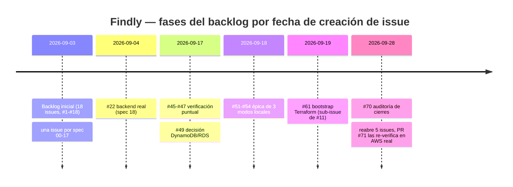

# 2. Contexto, objetivos, alcance y metodología

## Contexto, objetivos y alcance

Findly aborda la localización privada de fotografías de eventos para
asistentes que han otorgado consentimiento biométrico explícito y han
proporcionado una selfie autorizada. Los actores son el asistente, que
gestiona su inscripción y galería temporal, y el organizador autenticado, que
carga fotografías del evento.

El MVP mide una inscripción satisfactoria superior al 98 %, un procesamiento
de selfie inferior a tres segundos, una respuesta p95 de galería inferior a
500 ms y un umbral de similitud de Rekognition de al menos 95,0 % (capítulo 3
detalla la fuente y el estado de verificación de cada métrica). Se limita a
una única región AWS (ADR-004) y a una arquitectura serverless de coste fijo
cero en capa gratuita o sandbox (ADR-002).

Quedan fuera del alcance la vigilancia o el vídeo en tiempo real, imágenes no
autorizadas, menores sin consentimiento documentado del tutor, alta
disponibilidad o multirregión, RDS, EC2, VPC, NAT, EKS y comunicaciones
masivas por correo o SMS.

## Metodología de desarrollo

Findly se desarrolló con un equipo de cuatro personas (spec 01) mediante un
**backlog publicado como issues de GitHub**, trazable en ambas direcciones
con las especificaciones técnicas de `specs/` y con la evidencia reproducible
de `docs/evidence/`. `AGENTS.md`, el contrato de trabajo del repositorio,
exige que ninguna de las tres piezas — implementación, spec, issue — se cierre
sin sincronizar las otras dos.

### Ciclo de trabajo por tarea

Cada issue se trabaja siguiendo cuatro fases obligatorias, en orden:

1. **Research**: identificar la spec o specs que gobiernan el cambio, leer sus
   criterios de aceptación y contrastar explícitamente el flujo afectado,
   privacidad/retención, coste, observabilidad y contratos entre specs. No se
   inventan requisitos cuando una spec o un ADR ya los define.
2. **Plan**: un plan concreto (objetivo, ficheros/recursos que cambiarán,
   orden de implementación, estrategia de prueba, evidencia y ADR a crear,
   riesgos) presentado **antes** de tocar código. Cambios que alteren
   arquitectura, datos, permisos, coste o comportamiento público esperan
   confirmación explícita antes de implementar.
3. **Implement**: TypeScript estricto sin `any` ni supresiones de lint,
   Terraform reproducible con recursos etiquetados
   (`Project`/`Environment`/`ManagedBy`/`CostCenter`/`DataClass`), principio de
   mínimo privilegio, y pruebas actualizadas junto con la funcionalidad.
4. **Sync**: actualizar specs, ADRs, `README.md`, la memoria y la evidencia
   para que describan exactamente lo implementado y validado — nunca el
   diseño previo ni trabajo futuro presentado como hecho — y comentar la issue
   de GitHub con alcance, PR, validaciones, evidencia y pendientes. Una issue
   sólo se cierra cuando todos sus criterios están verificados, no cuando el
   código "está listo".

El trabajo se integra exclusivamente mediante ramas descriptivas
(`feature/`, `fix/`, `docs/`, `chore/`, `refactor/`) y pull requests: nunca hay
commits ni merges directos sobre `main`. Los mensajes de commit siguen
Conventional Commits, verificado por un hook `commit-msg`.

### Fases del proyecto

La numeración de las specs codifica el orden de trabajo planeado
(`specs/README.md`): **00-03** fundación, **04-09** producto, **10-15**
plataforma, **16-17** cierre y **18-19** evolución posterior. En la práctica,
el histórico de las 29 issues del repositorio muestra tres fases:

**Fase 1 — Backlog inicial (03-sep-2026).** Las 18 primeras issues (`#1`-`#18`)
se crean el mismo día, una por cada spec de la 00 a la 17: el equipo congela
primero el backlog completo (alcance, ADRs, métricas, fundación técnica,
contratos, y cada capacidad de producto y de plataforma) y lo publica entero
antes de empezar a implementar, en vez de descubrirlo incrementalmente.

**Fase 2 — Evolución y verificación puntual (04-sep a 19-sep).** Tras
completar la primera vuelta de implementación, aparecen issues de dos tipos
distintos: evolución planeada (`#22`, sustituir los mocks web por el backend
real, spec 18) y verificación puntual nacida de un gap concreto detectado al
cerrar otra issue — por ejemplo `#45`/`#46`/`#47` piden demostrar en un
entorno AWS real la firma/CORS de `#6`, el desvío a la DLQ de `#8` y el
derecho al olvido de `#10`, respectivamente, porque sus pruebas originales
sólo cubrían mocks. `#49` abre formalmente la decisión DynamoDB frente a RDS
como un análisis, no como una implementación (capítulo 3). `#51` es una épica
con tres sub-issues (`#52`/`#53`/`#54`) para los tres modos de ejecución local
— mock, Floci, sandbox AWS —, cada uno con su propio alcance de prueba
explícito para que una suite verde en un modo no se presente como evidencia
de otro (spec 19). `#61` es sub-issue explícita de `#11` para acotar
justamente la parte de esa issue que exige AWS real.

**Fase 3 — Auditoría de cierres (28-sep-2026).** `#70` es cualitativamente
distinta: no añade una capacidad, **audita las 19 issues ya cerradas** contra
sus propios criterios de aceptación y la evidencia real disponible, sin
ejecutar AWS ni cambiar código en la propia auditoría
(`docs/evidence/issue-checklist-audit.md`). El resultado reabre cinco issues
por no tener evidencia desplegada — `#6`, `#8`, `#10`, `#13`, `#22` — pese a
que sus checks de CI estaban en verde: una suite con `aws-sdk-client-mock`,
HTTP interceptado o Floci no acredita AWS real, y la auditoría lo señala
explícitamente issue por issue. La corrección se organiza con **tres agentes
en worktrees Git separados**, trabajando en paralelo sobre inscripción
pública, borrado/retención y verificación, integrados en una única PR (`#71`)
que sí ejecuta el stack en un entorno AWS efímero real y adjunta el enlace al
run de GitHub Actions como evidencia. `#6` y `#8` se recierran ese mismo día
con esa prueba; `#10`, `#13`, `#18` y `#22` permanecen abiertas porque siguen
sin cubrir alguno de sus propios criterios (capítulos 8 y 9 detallan
exactamente cuál en cada caso).

### Trazabilidad completa de issues

| #   | Título                                           | Spec | Creada | Estado                            | Fase  |
| --- | ------------------------------------------------ | ---- | ------ | --------------------------------- | ----- |
| 1   | Alcance, ADRs y métricas                         | 00   | 03-sep | Cerrada 03-sep                    | 1     |
| 2   | Fundación del repositorio                        | 01   | 03-sep | Cerrada 03-sep                    | 1     |
| 3   | Dominio, contratos y claves DynamoDB             | 02   | 03-sep | Cerrada 09-sep                    | 1     |
| 4   | Web estática e inscripción pública               | 03   | 03-sep | Cerrada 09-sep                    | 1     |
| 5   | Administración y Cognito                         | 04   | 03-sep | Cerrada 18-sep                    | 1     |
| 6   | Cargas prefirmadas y claves S3                   | 05   | 03-sep | Reabierta por #70, cerrada 28-sep | 1 → 3 |
| 7   | Inscripción facial                               | 06   | 03-sep | Abierta                           | 1     |
| 8   | Fotos de evento y matching                       | 07   | 03-sep | Reabierta por #70, cerrada 28-sep | 1 → 3 |
| 9   | Galería privada                                  | 08   | 03-sep | Cerrada 17-sep                    | 1     |
| 10  | Consentimiento y borrado                         | 09   | 03-sep | Reabierta por #70, abierta        | 1 → 3 |
| 11  | Estado Terraform y entornos                      | 10   | 03-sep | Abierta; verificada vía #61       | 1     |
| 12  | Infraestructura serverless segura                | 11   | 03-sep | Cerrada 14-sep                    | 1     |
| 13  | Observabilidad y FinOps                          | 12   | 03-sep | Reabierta por #70, abierta        | 1 → 3 |
| 14  | CI y artefactos                                  | 13   | 03-sep | Cerrada 04-sep                    | 1     |
| 15  | Despliegue manual OIDC                           | 14   | 03-sep | Abierta                           | 1     |
| 16  | Entorno efímero de PR y destrucción garantizada  | 15   | 03-sep | Cerrada 17-sep                    | 1     |
| 17  | Validación integral                              | 16   | 03-sep | Cerrada 18-sep                    | 1     |
| 18  | Memoria, ADR y runbook                           | 17   | 03-sep | Reabierta por #70, abierta        | 1 → 3 |
| 22  | Sustituir mocks web por backend real             | 18   | 04-sep | Reabierta por #70, abierta        | 2 → 3 |
| 45  | Validar CORS y firma de subidas en CI efímera    | —    | 17-sep | Cerrada 28-sep                    | 2     |
| 46  | Demostrar el desvío a DLQ en AWS efímero         | —    | 17-sep | Cerrada 28-sep                    | 2     |
| 47  | Verificar en AWS el derecho al olvido            | —    | 17-sep | Cerrada 28-sep                    | 2     |
| 49  | Decisión: DynamoDB frente a RDS                  | —    | 17-sep | Abierta (análisis, sin decisión)  | 2     |
| 51  | Épica: tres modos de ejecución local             | 19   | 18-sep | Cerrada 18-sep                    | 2     |
| 52  | Modo local con mocks                             | 19   | 18-sep | Cerrada 18-sep                    | 2     |
| 53  | Modo local con Floci                             | 19   | 18-sep | Cerrada 18-sep                    | 2     |
| 54  | Modo local contra AWS sandbox                    | 19   | 18-sep | Cerrada 18-sep                    | 2     |
| 61  | Verificar bootstrap Terraform (sub-issue de #11) | 10   | 19-sep | Verificada en AWS 02-oct          | 2     |
| 70  | Auditoría de cierres                             | —    | 28-sep | Abierta (coordina la fase 3)      | 3     |

### La auditoría como puerta de calidad

El hallazgo metodológico más relevante de este proyecto es que **una suite de
CI en verde no fue tratada como criterio suficiente de cierre**. `AGENTS.md`
ya lo exigía por escrito desde el inicio («no se cierra una issue sin
evidencia verificable»), pero la fase 3 demuestra que hizo falta una auditoría
explícita e independiente — no la propia implementación autoevaluándose —
para hacerlo cumplir de forma sistemática sobre issues que ya se habían dado
por cerradas. `docs/evidence/issue-checklist-audit.md` documenta, issue por
issue, la distinción entre "cierre respaldado" y "cierre no respaldado por
todos sus criterios", con el comando o el run exacto que falta en cada caso.
Esta disciplina se mantiene: la propia issue `#18` (esta memoria) permanece
abierta hasta que exista una SPA de demostración publicada (capítulo 9), no
se cierra por haber escrito este capítulo.
