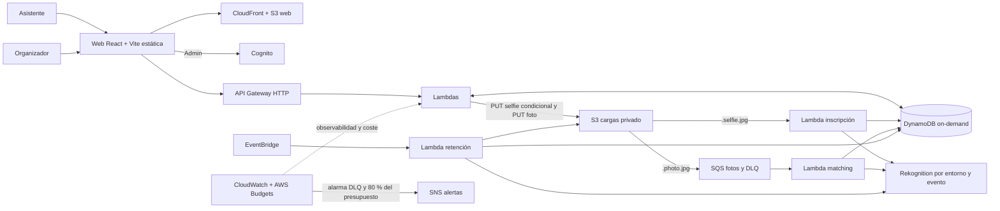

# 4. Arquitectura y decisiones

Este capítulo se organiza en dos niveles: **HLD** (diseño de alto nivel — visión
del sistema, componentes y sus relaciones, decisiones que fijan la forma de la
arquitectura) y **LLD** (diseño de bajo nivel — contratos, claves, permisos y
comportamiento exacto de cada componente). El HLD responde a «qué piezas
existen y por qué»; el LLD responde a «cómo funciona cada pieza por dentro».
Ambos remiten a los ADR correspondientes como fuente de la decisión, no la
repiten.

## HLD — Diseño de alto nivel

### Visión general

La web de Findly es una SPA estática con React, Vite y TypeScript. ADR-001
descarta Next.js: no se requiere SSR y la salida `dist/` se distribuye desde
Amazon S3 mediante CloudFront con Origin Access Control. Las interacciones
dinámicas se resuelven contra un único API Gateway HTTP y funciones Lambda;
no hay servidor propio, balanceador ni contenedor de larga duración
(ADR-002). Los datos transaccionales viven en una única tabla DynamoDB
on-demand (ADR-007 documenta el índice global de eventos); las imágenes
(selfies y fotos de evento) en un bucket S3 privado, nunca públicas.



### Componentes principales

| Componente                          | Responsabilidad                                                                 | Decisión asociada |
| ----------------------------------- | ------------------------------------------------------------------------------- | ----------------- |
| Web estática (CloudFront+S3)        | Sirve la SPA; enruta 403/404 a `index.html` para el cliente-side routing.       | ADR-001           |
| API Gateway HTTP                    | Único punto de entrada; JWT de Cognito en rutas de administración.              | —                 |
| `publicEvents` / `publicEnrollment` | Descubrimiento de eventos, consentimiento, emisión de token y sondeo de estado. | ADR-011           |
| `selfieIndexer`                     | Indexa el rostro en Rekognition tras el `PUT` condicional del selfie.           | ADR-011, ADR-014  |
| `photoMatcher`                      | Matching asíncrono desacoplado por SQS/DLQ.                                     | ADR-006           |
| `adminEvents`                       | Gestión de eventos y carga masiva de fotos (JWT de Cognito).                    | —                 |
| `gallery` (GalleryReader)           | Resuelve la galería privada por token opaco.                                    | ADR-005           |
| `deleteRegistration`                | Derecho al olvido: borra registro, coincidencias, token, selfie y `FaceId`.     | ADR-013           |
| `retentionPurger`                   | Purga programada de eventos caducados.                                          | —                 |
| DynamoDB (tabla única)              | Estado transaccional: eventos, registros, fotos, coincidencias, tokens.         | ADR-007           |
| S3 (cargas)                         | Selfies y fotos, privado, sin acceso público.                                   | —                 |
| Rekognition                         | Indexación y búsqueda facial, colecciones aisladas por entorno/evento.          | ADR-015           |
| SNS + AWS Budgets                   | Alerta de la DLQ y del presupuesto mensual.                                     | issue #13         |

### Decisiones de arquitectura (visión general)

- **ADR-001**: React + Vite en lugar de Next.js, sin SSR.
- **ADR-002**: serverless sin RDS, EC2, NAT ni VPC dedicada.
- **ADR-004**: región única `eu-west-1`.
- **ADR-006**: ingesta de fotos desacoplada S3 → SQS → Lambda.
- **ADR-008**: entorno efímero de pull request para CI, con OIDC y estado
  aislado por número de PR.
- **ADR-009**: estado remoto de Terraform por entorno, con bloqueo nativo de
  S3.
- **ADR-011**: capacidad de inscripción pública (contrato aprobado que separa
  `publicEvents`/`publicEnrollment`/`selfieIndexer`).

La continuación de la issue #70 añadió tres decisiones que también son de
alto nivel porque cambian el modelo de fallo del sistema, no sólo un detalle
de implementación: **ADR-013** (el borrado se reconcilia con un localizador
sin TTL en vez de asumir que el registro siempre existe), **ADR-014** (una
selfie no puede sobrescribirse una vez subida) y **ADR-015** (las colecciones
de Rekognition se aíslan por entorno y evento, no una única colección
global). Ninguna transacción atómica cubre DynamoDB, S3 y Rekognition a la
vez; el capítulo 6 detalla cómo se reconcilian los fallos parciales.

## LLD — Diseño de bajo nivel

### Contratos de API (HTTP)

| Ruta                                          | Handler                                        | Auth                             |
| --------------------------------------------- | ---------------------------------------------- | -------------------------------- |
| `GET /events`                                 | `publicEvents.listPublicEvents`                | Pública                          |
| `GET /events/{eventId}`                       | `publicEvents.getPublicEvent`                  | Pública                          |
| `POST /events/{eventId}/registrations`        | `publicEnrollment.createPublicRegistration`    | Pública                          |
| `GET /registrations/{registrationId}/status`  | `publicEnrollment.getPublicRegistrationStatus` | Token de galería                 |
| `DELETE /registrations/{registrationId}`      | `deleteRegistration`                           | Token de galería                 |
| `GET /gallery`                                | `gallery`                                      | Token de galería (query `token`) |
| `GET /admin/events`                           | `adminEvents.listAdminEvents`                  | JWT Cognito                      |
| `POST /admin/events`                          | `adminEvents.createAdminEvent`                 | JWT Cognito                      |
| `POST /admin/events/{eventId}/photos/uploads` | `adminEvents.createPhotoUploads`               | JWT Cognito                      |

Contratos exactos en `src/shared/types/api.ts`. Ningún error expone datos
internos: toda respuesta de error sigue `{ code, message, requestId }`
(`ApiError`).

### Modelo de datos (tabla única DynamoDB)

| Entidad                | `PK`                   | `SK`                   | Índice                                                                 |
| ---------------------- | ---------------------- | ---------------------- | ---------------------------------------------------------------------- |
| Evento                 | `EVENT#{eventId}`      | `METADATA`             | `GSI2`: `ENTITY#EVENT` / `{date}#{eventId}` (listado admin sin `Scan`) |
| Registro (inscripción) | `EVENT#{eventId}`      | `REG#{registrationId}` | —                                                                      |
| Foto de evento         | `EVENT#{eventId}`      | `PHOTO#{photoId}`      | —                                                                      |
| Coincidencia           | `REG#{registrationId}` | `MATCH#{photoId}`      | —                                                                      |
| Token de galería       | `TOKEN#{tokenHash}`    | `METADATA`             | —                                                                      |
| Rostro → registro      | —                      | —                      | `GSI1`: `FACE#{faceId}` / `REG#{registrationId}`                       |

`toEpochSeconds` calcula el atributo `ttl` de purga por retención; los
constructores de clave están en `src/shared/lib/dynamoKeys.ts` y tienen
prueba unitaria propia (capítulo 8). Ningún handler ejecuta `Scan` salvo
`retentionPurger`, documentado como riesgo conocido en el análisis de la
issue #49.

### Claves de objeto S3

```text
events/{eventId}/selfies/{registrationId}.selfie.jpg
events/{eventId}/photos/{photoId}.photo.jpg
```

`src/shared/lib/s3Keys.ts` construye y analiza ambas rutas; el sufijo
distingue selfies de fotos de evento para que un mismo prefijo `events/`
sirva a los dos flujos de notificación S3 (ADR-012).

### Colecciones de Rekognition

`${project}-${environment}-event-{eventId}` (ADR-015): aísla por entorno y
evento, para que un handler de `sandbox` nunca pueda consultar o borrar caras
de `demo`/`production`. Las colecciones creadas antes de esta decisión
(`findly-event-{eventId}`, sin sufijo de entorno) requieren una migración
explícita, no ejecutada (capítulo 9).

### IAM de mínimo privilegio

Cada Lambda tiene su propio rol, sin acciones ni recursos compartidos más
allá de lo necesario. Ejemplo (`admin-api`, `infra/modules/admin-api/main.tf`):
`listAdminEvents` sólo tiene `dynamodb:Query` sobre `GSI2`; `createAdminEvent`
sólo `dynamodb:PutItem` sobre la tabla; `createPhotoUploads` sólo
`dynamodb:GetItem`/`PutItem` y `s3:PutObject` acotado al prefijo
`events/*/photos/*`. Ningún rol usa `Resource = "*"` salvo donde AWS no admite
ARN de recurso para esa acción concreta, documentado inline en cada módulo.

### Observabilidad y resiliencia (nivel de detalle)

Cada Lambda escribe logs JSON con `correlationId` y una lista cerrada de
campos (capítulo 7). La cola de fotos usa `visibility_timeout = 180s` (6× el
`timeout` de 30s de `photoMatcher`) y una DLQ con `maxReceiveCount = 3`; una
alarma CloudWatch sobre `ApproximateNumberOfMessagesVisible >= 1` notifica al
topic SNS de alertas. El detalle de permisos y validación real en AWS está en
el capítulo 8 y en `docs/runbooks/issue-70-aws-review.md`.
