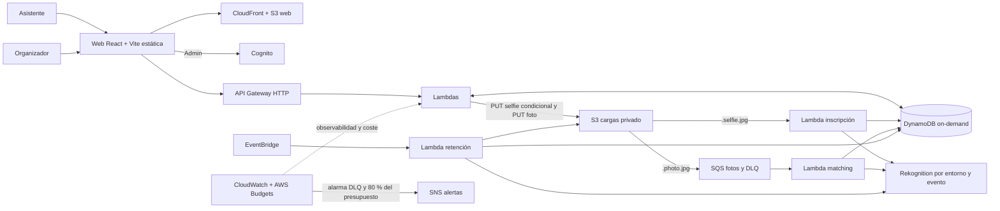
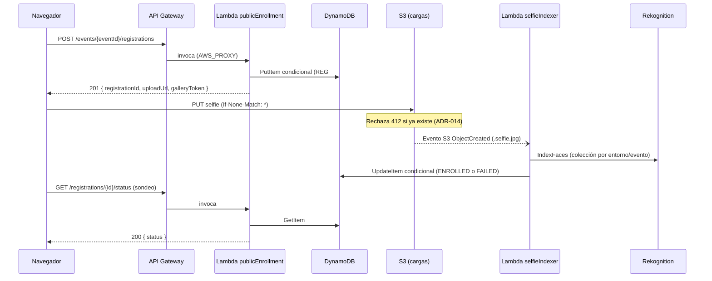
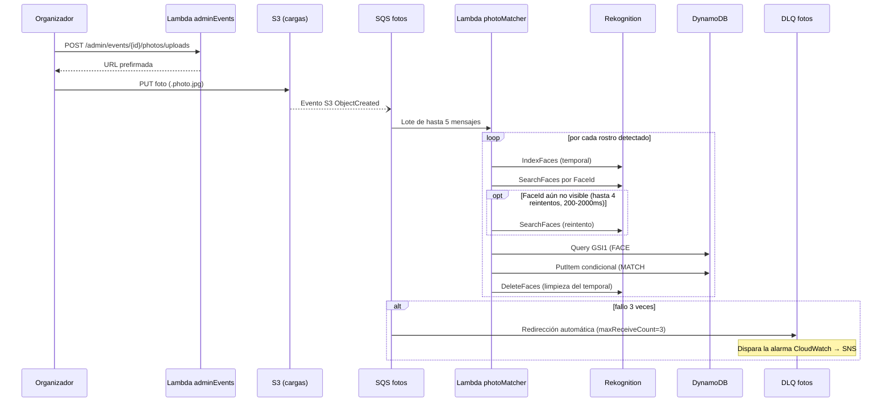
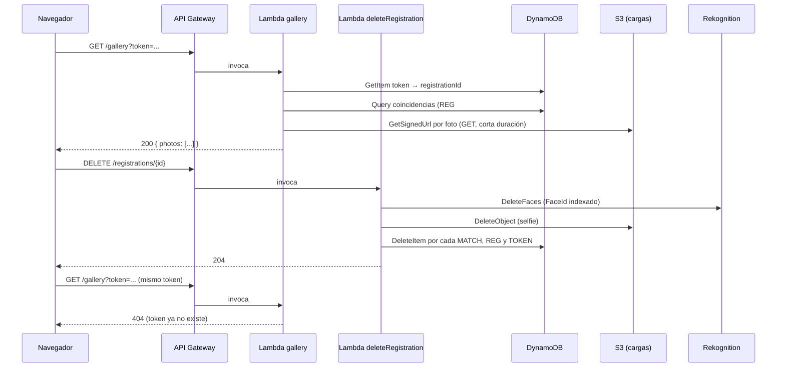
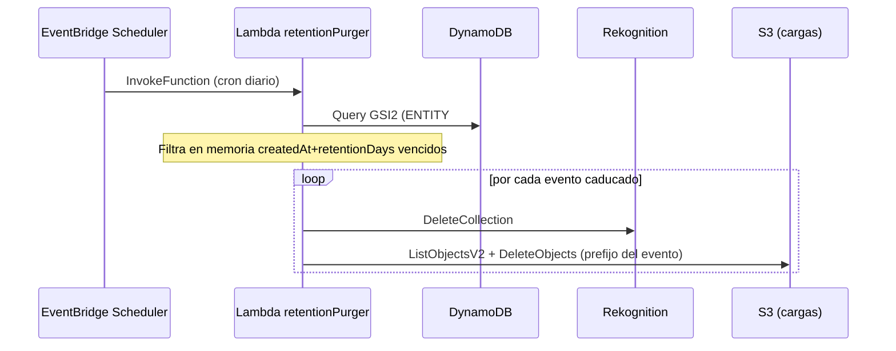
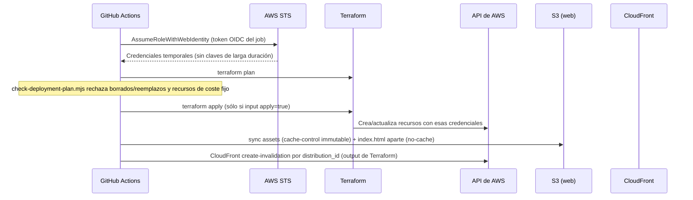

# 4. Arquitectura y decisiones

Este capítulo se organiza en dos niveles: **HLD** (diseño de alto nivel — visión
del sistema, componentes y sus relaciones, decisiones que fijan la forma de la
arquitectura) y **LLD** (diseño de bajo nivel — contratos, claves, permisos y
comportamiento exacto de cada componente). El HLD responde a «qué piezas
existen y por qué»; el LLD responde a «cómo funciona cada pieza por dentro».
Ambos remiten a los ADR correspondientes como fuente de la decisión, no la
repiten.

## HLD — Diseño de alto nivel

### Visión general

La web de Findly es una SPA estática con React, Vite y TypeScript. ADR-001
descarta Next.js: no se requiere SSR y la salida `dist/` se distribuye desde
Amazon S3 mediante CloudFront con Origin Access Control. Las interacciones
dinámicas se resuelven contra un único API Gateway HTTP y funciones Lambda;
no hay servidor propio, balanceador ni contenedor de larga duración
(ADR-002). Los datos transaccionales viven en una única tabla DynamoDB
on-demand (ADR-007 documenta el índice global de eventos); las imágenes
(selfies y fotos de evento) en un bucket S3 privado, nunca públicas.



### Componentes principales

| Componente                          | Responsabilidad                                                                 | Decisión asociada |
| ----------------------------------- | ------------------------------------------------------------------------------- | ----------------- |
| Web estática (CloudFront+S3)        | Sirve la SPA; enruta 403/404 a `index.html` para el cliente-side routing.       | ADR-001           |
| API Gateway HTTP                    | Único punto de entrada; JWT de Cognito en rutas de administración.              | —                 |
| `publicEvents` / `publicEnrollment` | Descubrimiento de eventos, consentimiento, emisión de token y sondeo de estado. | ADR-011           |
| `selfieIndexer`                     | Indexa el rostro en Rekognition tras el `PUT` condicional del selfie.           | ADR-011, ADR-014  |
| `photoMatcher`                      | Matching asíncrono desacoplado por SQS/DLQ.                                     | ADR-006           |
| `adminEvents`                       | Gestión de eventos y carga masiva de fotos (JWT de Cognito).                    | —                 |
| `gallery` (GalleryReader)           | Resuelve la galería privada por token opaco.                                    | ADR-005           |
| `deleteRegistration`                | Derecho al olvido: borra registro, coincidencias, token, selfie y `FaceId`.     | ADR-013           |
| `retentionPurger`                   | Purga programada de eventos caducados.                                          | —                 |
| DynamoDB (tabla única)              | Estado transaccional: eventos, registros, fotos, coincidencias, tokens.         | ADR-007           |
| S3 (cargas)                         | Selfies y fotos, privado, sin acceso público.                                   | —                 |
| Rekognition                         | Indexación y búsqueda facial, colecciones aisladas por entorno/evento.          | ADR-015           |
| SNS + AWS Budgets                   | Alerta de la DLQ y del presupuesto mensual.                                     | issue #13         |

> **Nota de numeración de ADRs:** la PR #72 (issue #7) introdujo en `main` un
> segundo `ADR-010-selfie-enrollment-boundaries.md` y un segundo
> `ADR-011-pending-erasure-recovery.md`, que coexisten con los ficheros
> homónimos ya vigentes. Ambos proceden de la rama de esa issue antes de
> alinearse con `main` y llevan su propio aviso de documento histórico; el de
> borrado, además, queda marcado "aplazado, no implementado" (capítulo 9). Toda
> referencia a **ADR-011** en este capítulo apunta al fichero vigente,
> `ADR-011-public-enrollment-capability.md`. La colisión de numeración en sí
> no se ha resuelto — es una decisión pendiente de la persona responsable.

### Catálogo de servicios e integraciones

Findly combina 14 servicios de AWS con herramientas de terceros para CI/CD y
calidad. La siguiente tabla explica, para cada uno, **cómo habla con el
siguiente componente de la cadena** — el mecanismo exacto, no sólo el nombre
del servicio —, porque la pregunta relevante en una arquitectura serverless no
es qué servicios existen, sino cómo se disparan y autorizan entre sí sin un
proceso propio que los orqueste.

| Servicio / herramienta       | Rol en Findly                              | Cómo se comunica con el siguiente componente                                                                                                                                                                      |
| ---------------------------- | ------------------------------------------ | ----------------------------------------------------------------------------------------------------------------------------------------------------------------------------------------------------------------- |
| Amazon CloudFront            | CDN y única puerta HTTPS de la SPA         | Origin Access Control (OAC) firma cada petición a S3; la política del bucket sólo confía en esa distribución concreta, nunca en acceso público.                                                                   |
| Amazon S3 (web)              | Aloja los ficheros estáticos de `dist/`    | Objeto servido por CloudFront; sin URL pública propia.                                                                                                                                                            |
| Amazon Cognito               | Identidad de organizadores                 | `USER_PASSWORD_AUTH` desde el navegador; emite un JWT que el cliente adjunta como `Authorization: Bearer`.                                                                                                        |
| Amazon API Gateway (HTTP)    | Punto de entrada único de la API           | Verifica el JWT con un autorizador nativo (audiencia = App Client de Cognito) en rutas `/admin/*`; para el resto, invoca la Lambda directamente vía `AWS_PROXY`.                                                  |
| AWS Lambda (handlers HTTP)   | Lógica de negocio sin servidor             | Llama a DynamoDB y S3 con el SDK v3 usando las credenciales temporales de su rol de ejecución (sin claves).                                                                                                       |
| Amazon S3 (cargas)           | Selfies y fotos, privado                   | Emite un **evento nativo de notificación** al escribir un objeto — sin que ninguna Lambda haga polling —, enrutado por sufijo de clave a una cola SQS (`.photo.jpg`) o directamente a una Lambda (`.selfie.jpg`). |
| Amazon SQS + DLQ             | Amortigua picos de fotos, aísla fallos     | `photoMatcher` la consume por lotes (`batch_size = 5`); tras 3 intentos fallidos el mensaje pasa automáticamente a la DLQ, sin código propio de reintento.                                                        |
| Amazon Rekognition           | Indexación y búsqueda facial               | Llamadas SDK síncronas (`IndexFaces`/`SearchFaces`/`DeleteFaces`) dentro de la propia invocación Lambda; no es un servicio en segundo plano.                                                                      |
| Amazon DynamoDB              | Estado transaccional de toda la aplicación | SDK v3 (`@aws-sdk/lib-dynamodb`); ninguna Lambda mantiene una conexión abierta entre invocaciones.                                                                                                                |
| Amazon EventBridge Scheduler | Dispara la purga por retención             | Invoca `retentionPurger` con `lambda:InvokeFunction` según una expresión cron, sin cola intermedia.                                                                                                               |
| Amazon CloudWatch Logs       | Observabilidad                             | Cada Lambda escribe JSON estructurado a su propio grupo de logs (retención 14 días); un filtro de métrica cuenta errores sin re-procesar el texto.                                                                |
| Amazon CloudWatch Alarms     | Detección de fallos                        | Vigila `ApproximateNumberOfMessagesVisible` de la DLQ; al disparar, publica en el topic SNS.                                                                                                                      |
| Amazon SNS                   | Difusión de alertas                        | Un único topic recibe de CloudWatch Alarms y de AWS Budgets; reenvía a una suscripción de correo confirmada por el destinatario.                                                                                  |
| AWS Budgets                  | Control de gasto                           | Evalúa el gasto real de la cuenta cada día; al superar el 80 % del umbral, publica en el mismo topic SNS.                                                                                                         |

### Integración con proveedores externos (no AWS)

| Herramienta                                                        | Rol                                                          | Cómo se conecta con AWS o con el resto del sistema                                                                                                                                                                                                                                                |
| ------------------------------------------------------------------ | ------------------------------------------------------------ | ------------------------------------------------------------------------------------------------------------------------------------------------------------------------------------------------------------------------------------------------------------------------------------------------- |
| GitHub Actions                                                     | Motor de CI/CD                                               | **Nunca usa claves de acceso AWS.** Intercambia el token OIDC del _job_ por credenciales temporales vía `sts:AssumeRoleWithWebIdentity`; el rol de IAM confía sólo en el `sub` exacto que GitHub emite (por ejemplo `repo:upc-malvaviscos/findly:pull_request` para el entorno efímero, ADR-008). |
| Terraform + proveedor AWS                                          | Aprovisiona toda la infraestructura como código              | Llama a la API de AWS con las credenciales que le pasa el paso anterior de OIDC; el estado se guarda cifrado en S3 con bloqueo nativo (`use_lockfile = true`, ADR-009), sin tabla DynamoDB de bloqueo adicional.                                                                                  |
| Dependabot                                                         | Mantenimiento de dependencias npm                            | Abre PRs automáticas semanales contra `main`; no tiene credenciales AWS ni permisos de despliegue, sólo escritura de rama vía la app de GitHub.                                                                                                                                                   |
| Playwright                                                         | Pruebas E2E en navegador real                                | Dirige Chromium/Firefox/WebKit contra la SPA servida en local o contra el stack efímero; nunca contra `demo`/`production`.                                                                                                                                                                        |
| Floci                                                              | Emulación local de AWS (S3 y DynamoDB)                       | Las Lambdas apuntan su SDK a `AWS_ENDPOINT_URL=http://floci:4566` en vez de a AWS real; el mismo código de producción se ejecuta sin cambios (capítulo 5).                                                                                                                                        |
| ESLint / Prettier / markdownlint-cli2 / tflint / github-actionlint | Calidad estática del código, Markdown, Terraform y workflows | Se ejecutan en local (`husky`) y en CI; ninguno llama a un servicio externo.                                                                                                                                                                                                                      |
| commitlint + husky                                                 | Disciplina de Conventional Commits                           | Hook `commit-msg` local; bloquea el commit antes de que llegue a GitHub.                                                                                                                                                                                                                          |

### Decisiones de arquitectura (visión general)

- **ADR-001**: React + Vite en lugar de Next.js, sin SSR.
- **ADR-002**: serverless sin RDS, EC2, NAT ni VPC dedicada.
- **ADR-004**: región única `eu-west-1`.
- **ADR-006**: ingesta de fotos desacoplada S3 → SQS → Lambda.
- **ADR-008**: entorno efímero de pull request para CI, con OIDC y estado
  aislado por número de PR.
- **ADR-009**: estado remoto de Terraform por entorno, con bloqueo nativo de
  S3.
- **ADR-011**: capacidad de inscripción pública (contrato aprobado que separa
  `publicEvents`/`publicEnrollment`/`selfieIndexer`; véase la nota de
  numeración de ADRs más arriba sobre el fichero histórico homónimo).

La continuación de la issue #70 añadió tres decisiones que también son de
alto nivel porque cambian el modelo de fallo del sistema, no sólo un detalle
de implementación: **ADR-013** (el borrado se reconcilia con un localizador
sin TTL en vez de asumir que el registro siempre existe), **ADR-014** (una
selfie no puede sobrescribirse una vez subida) y **ADR-015** (las colecciones
de Rekognition se aíslan por entorno y evento, no una única colección
global). Ninguna transacción atómica cubre DynamoDB, S3 y Rekognition a la
vez; el capítulo 6 detalla cómo se reconcilian los fallos parciales.

## LLD — Diseño de bajo nivel

### Contratos de API (HTTP)

| Ruta                                          | Handler                                        | Auth                             |
| --------------------------------------------- | ---------------------------------------------- | -------------------------------- |
| `GET /events`                                 | `publicEvents.listPublicEvents`                | Pública                          |
| `GET /events/{eventId}`                       | `publicEvents.getPublicEvent`                  | Pública                          |
| `POST /events/{eventId}/registrations`        | `publicEnrollment.createPublicRegistration`    | Pública                          |
| `GET /registrations/{registrationId}/status`  | `publicEnrollment.getPublicRegistrationStatus` | Token de galería                 |
| `DELETE /registrations/{registrationId}`      | `deleteRegistration`                           | Token de galería                 |
| `GET /gallery`                                | `gallery`                                      | Token de galería (query `token`) |
| `GET /admin/events`                           | `adminEvents.listAdminEvents`                  | JWT Cognito                      |
| `POST /admin/events`                          | `adminEvents.createAdminEvent`                 | JWT Cognito                      |
| `POST /admin/events/{eventId}/photos/uploads` | `adminEvents.createPhotoUploads`               | JWT Cognito                      |

Contratos exactos en `src/shared/types/api.ts`. Ningún error expone datos
internos: toda respuesta de error sigue `{ code, message, requestId }`
(`ApiError`).

### Modelo de datos (tabla única DynamoDB)

| Entidad                | `PK`                   | `SK`                   | Índice                                                                 |
| ---------------------- | ---------------------- | ---------------------- | ---------------------------------------------------------------------- |
| Evento                 | `EVENT#{eventId}`      | `METADATA`             | `GSI2`: `ENTITY#EVENT` / `{date}#{eventId}` (listado admin sin `Scan`) |
| Registro (inscripción) | `EVENT#{eventId}`      | `REG#{registrationId}` | —                                                                      |
| Foto de evento         | `EVENT#{eventId}`      | `PHOTO#{photoId}`      | —                                                                      |
| Coincidencia           | `REG#{registrationId}` | `MATCH#{photoId}`      | —                                                                      |
| Token de galería       | `TOKEN#{tokenHash}`    | `METADATA`             | —                                                                      |
| Rostro → registro      | —                      | —                      | `GSI1`: `FACE#{faceId}` / `REG#{registrationId}`                       |

`toEpochSeconds` calcula el atributo `ttl` de purga por retención; los
constructores de clave están en `src/shared/lib/dynamoKeys.ts` y tienen
prueba unitaria propia (capítulo 8). **Ningún handler ejecuta `Scan`**:
`retentionPurger` lo hacía sobre toda la tabla hasta que la fase 3 del
proyecto (issue #70, capítulo 2) lo corrigió para consultar `GSI2` igual que
el listado de administración, filtrando en memoria los eventos cuya
`createdAt + retentionDays` ya venció. El análisis de la issue #49 señaló el
`Scan` original como riesgo; queda resuelto, no pendiente.

### Claves de objeto S3

```text
events/{eventId}/selfies/{registrationId}.selfie.jpg
events/{eventId}/photos/{photoId}.photo.jpg
```

`src/shared/lib/s3Keys.ts` construye y analiza ambas rutas; el sufijo
distingue selfies de fotos de evento para que un mismo prefijo `events/`
sirva a los dos flujos de notificación S3 (ADR-012).

### Colecciones de Rekognition

`${project}-${environment}-event-{eventId}` (ADR-015): aísla por entorno y
evento, para que un handler de `sandbox` nunca pueda consultar o borrar caras
de `demo`/`production`. Las colecciones creadas antes de esta decisión
(`findly-event-{eventId}`, sin sufijo de entorno) requieren una migración
explícita, no ejecutada (capítulo 9).

### IAM de mínimo privilegio

Cada Lambda tiene su propio rol, sin acciones ni recursos compartidos más
allá de lo necesario. Ejemplo (`admin-api`, `infra/modules/admin-api/main.tf`):
`listAdminEvents` sólo tiene `dynamodb:Query` sobre `GSI2`; `createAdminEvent`
sólo `dynamodb:PutItem` sobre la tabla; `createPhotoUploads` sólo
`dynamodb:GetItem`/`PutItem` y `s3:PutObject` acotado al prefijo
`events/*/photos/*`. Ningún rol usa `Resource = "*"` salvo donde AWS no admite
ARN de recurso para esa acción concreta, documentado inline en cada módulo.

### Observabilidad y resiliencia (nivel de detalle)

Cada Lambda escribe logs JSON con `correlationId` y una lista cerrada de
campos (capítulo 7). La cola de fotos usa `visibility_timeout = 180s` (6× el
`timeout` de 30s de `photoMatcher`) y una DLQ con `maxReceiveCount = 3`; una
alarma CloudWatch sobre `ApproximateNumberOfMessagesVisible >= 1` notifica al
topic SNS de alertas. El detalle de permisos y validación real en AWS está en
el capítulo 8 y en `docs/runbooks/issue-70-aws-review.md`.

### Flujos de secuencia

Los siguientes diagramas muestran el orden exacto de llamadas entre
componentes para cada recorrido de negocio, no sólo qué servicios
intervienen. Todos están verificados contra AWS real en el run de aceptación
de PR #71 (capítulo 8), salvo el de purga, cuyo disparo real por
`EventBridge Scheduler` sigue pendiente (capítulo 9).

**Inscripción pública e indexación facial** (ADR-011 vigente, ADR-014 — no
confundir con el ADR-011 histórico posterior, nota de numeración más arriba):



**Matching de fotos de evento** (ADR-006, spec 07):



`SearchFaces` puede devolver `InvalidParameterException` con el mensaje
"FaceId was not found in the collection" justo después de un `IndexFaces` que
sí indexó ese rostro: una inconsistencia eventual real de Rekognition, no un
error de la aplicación. `photoMatcher` reintenta exclusivamente esa respuesta
concreta hasta 4 veces con espera creciente (200, 500, 1000, 2000 ms) antes de
dejar que el error se propague al conteo de reintentos de SQS. El paso que
falla (`index_faces`, `search_faces`, `write_match` o `delete_faces`) se
registra en el log de error para diagnóstico, sin datos sensibles.

**Galería privada y derecho al olvido** (ADR-005, ADR-013):



**Purga por retención** (spec 09; disparo real por Scheduler pendiente):



**Despliegue vía GitHub Actions y OIDC** (ADR-008, spec 14; el capítulo 5
detalla la puerta de aprobación y el guardián de destrucción del plan):



### Integración de la calidad local

`husky` engancha `pre-commit` (formato de lo modificado) y `pre-push`
(`npm run harness:check` seguido de `npm run verify` completo); ninguno de los
dos llama a AWS. La misma matriz de comandos —lint, tipos, tests, build,
Terraform, seguridad y sincronización de documentación— se repite en CI
(`ci.yml`) para que un fallo local y uno remoto compartan siempre la misma
causa (capítulo 5 detalla cada workflow).
