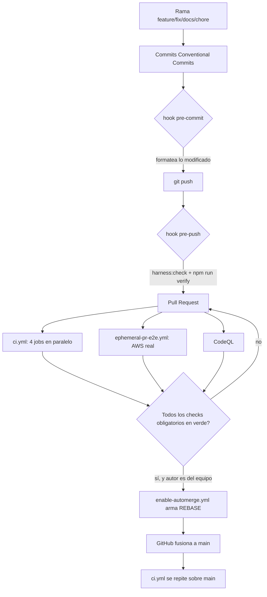

# 5. Implementación y CI/CD

Este capítulo describe **cómo** se construye, empaqueta, valida y despliega
Findly — el mecanismo técnico —, complementando el "por qué" de la
metodología del capítulo 2. React + Vite y TypeScript compilan la SPA;
esbuild empaqueta las Lambdas; Terraform describe la infraestructura; GitHub
Actions ejecuta seis workflows distintos, cada uno con una responsabilidad
única, sobre autenticación federada OIDC sin ninguna clave de acceso AWS
almacenada como secreto.

## Empaquetado de Lambdas

`npm run build` encadena cuatro pasos, cada uno verificado por separado:

1. `build:web` — `vite build` genera `dist/`.
2. `build:lambdas` — `esbuild src/lambdas/*.ts --bundle --platform=node
--target=node24 --format=cjs --outdir=artifacts/lambdas` produce un `.js`
   autocontenido por cada handler (una Lambda por fichero en
   `src/lambdas/`, sin una carpeta por función).
3. `package:lambdas` (`scripts/package-lambda-artifacts.mjs`) comprime cada
   `.js` a un `.zip` propio con `Compress-Archive` en Windows o `zip -j` en
   Linux/CI, porque `aws_lambda_function.filename`/`source_code_hash` en
   Terraform exigen un `.zip` real, no el `.js` suelto.
4. `verify:lambdas` (`scripts/verify-lambda-artifacts.mjs`) no sólo comprueba
   que cada `.js` y `.zip` existan: copia el `.js` a un directorio temporal y
   ejecuta `node -e 'require("./index.js")'` sobre él. Es una prueba de humo
   real del bundle — detecta un `require` roto o una dependencia no
   empaquetada antes de subir el artefacto a AWS, no sólo antes de que exista
   el fichero.

El runtime gestionado de Lambda es Node.js 24.x (`nodejs24.x`, actualizado
junto con el proveedor Terraform de AWS a la serie 6.x durante la fase 3 del
proyecto); el `target=node24` de esbuild coincide exactamente para que el
bundle no dependa de una sintaxis que el runtime no soporte.

## Terraform: módulos y raíces

`infra/modules/` contiene 15 módulos reutilizables (capítulo 4 detalla cada
uno); `findly-stack` los compone en un único stack. Cinco raíces (`roots`)
Terraform consumen ese stack o son independientes:

| Raíz                            | Propósito                                                          | Backend de estado                                          |
| ------------------------------- | ------------------------------------------------------------------ | ---------------------------------------------------------- |
| `infra/bootstrap`               | Crea el bucket S3 de estado (versionado, SSE-S3, TLS-only)         | Local (se aplica una única vez, manualmente)               |
| `infra/environments/sandbox`    | Entorno de desarrollo compartido                                   | S3 remoto, clave `findly/sandbox/terraform.tfstate`        |
| `infra/environments/demo`       | Entorno de demostración                                            | S3 remoto, clave `findly/demo/terraform.tfstate`           |
| `infra/environments/production` | Entorno de producción (no usado en este TFM académico)             | S3 remoto, clave `findly/production/terraform.tfstate`     |
| `infra/ephemeral`               | Un stack completo por número de pull request, aislado y desechable | S3 remoto, clave `ephemeral/pr-{numero}/terraform.tfstate` |

Todas comparten bloqueo nativo de S3 (`use_lockfile = true`, ADR-009): ninguna
tabla DynamoDB adicional gestiona el lock.

## Los seis workflows de GitHub Actions

### `ci.yml` — validación estática en cada PR y en cada push a `main`

Cuatro jobs en **paralelo**, sin AWS: `frontend` (lint, tipos, 294 tests con
cobertura, build, sube `dist/` y el informe de cobertura como artefactos);
`terraform` (`actionlint`, `terraform fmt -check`, `terraform validate`,
`tflint`); `security-and-sync` (Markdown, `npm audit` de dependencias de
producción, y `sync:check`, capítulo 2); `e2e` (Playwright contra el mock del
navegador y contra Floci, con caché de binarios por sistema operativo y
`package-lock.json`). GitHub también ejecuta CodeQL mediante su configuración
de análisis de código por defecto a nivel de repositorio, no como un fichero
de workflow versionado en este repositorio.

### `ephemeral-pr-e2e.yml` — el único check que despliega AWS real

Se dispara al abrir, reabrir o actualizar una PR interna no draft
(`github.event.pull_request.head.repo.full_name == github.repository`, para
que un OIDC de `pull_request` nunca se conceda a un fork). Un único job,
`provision-test-destroy`, con `concurrency` por número de PR para que dos
ejecuciones del mismo PR nunca se solapen:

1. Exige por variable de repositorio el rol OIDC y el bucket de estado
   (`AWS_EPHEMERAL_CI_ROLE_ARN`, `AWS_TERRAFORM_STATE_BUCKET`); falla con un
   mensaje explícito si faltan, en vez de un error opaco más adelante.
2. Asume el rol con `aws-actions/configure-aws-credentials`, empaqueta las
   Lambdas e inicializa un estado remoto exclusivo de ese número de PR.
3. Genera el plan, lo convierte a JSON y **rechaza explícitamente** cualquier
   recurso de coste fijo (`aws_vpc`, `aws_nat_gateway`, `aws_instance`,
   `aws_db_instance`/`_cluster`, `aws_lb`, `aws_eks_cluster`) antes de aplicar
   nada — el mismo guardián que en el despliegue manual (`check-deployment-plan.mjs`,
   siguiente sección, aunque aquí embebido en el propio workflow).
4. Aplica, y verifica con `aws s3api` que el bucket de cargas desplegado tiene
   las cuatro banderas de bloqueo público activas y SSE-S3.
5. Instala Chromium e invoca dos scripts contra el stack **real y ya
   desplegado**: `deployed-ephemeral-happy-path.mjs` (organizador: eventos,
   carga masiva, vía la API con un token de Cognito real) y
   `deployed-issue-70-acceptance.mjs` (330 líneas: recorrido completo con un
   navegador Chromium real — inscripción, indexación, matching, galería,
   borrado — más comprobaciones directas por SDK de DynamoDB y Rekognition
   para confirmar la limpieza).
6. Destruye el entorno en un paso con `if: always()`, incluso si el paso
   anterior falló, siempre que la asunción del rol OIDC haya tenido éxito.

### `deploy.yml` — despliegue manual con doble puerta de aprobación

`workflow_dispatch` con dos entradas: `environment` (`sandbox`/`demo`/`production`)
y `apply` (booleano, por defecto `false`). El job usa
`environment: ${{ inputs.environment }}`, que activa la puerta de aprobación
nativa de GitHub Environments — una persona debe aprobar la ejecución antes de
que el job arranque, si el entorno la tiene configurada. Con `apply=false` el
workflow sólo genera y valida el plan (una ejecución "en seco" segura de
repetir); con `apply=true` aplica exactamente ese plan y publica la SPA.

El guardián `scripts/check-deployment-plan.mjs` lee el plan en JSON y falla si
contiene **cualquier** borrado o reemplazo de un recurso existente, o
**cualquier** recurso de la misma lista de coste fijo prohibida en el
entorno efímero — un despliegue manual no debe poder destruir por accidente
lo que ya existe en `demo`/`production`. La publicación de la SPA distingue
caché por tipo de fichero: los assets con hash en el nombre (`dist/assets/*`)
se suben con `cache-control: public,max-age=31536000,immutable`, e
`index.html` aparte con `no-cache`, para que un despliegue nuevo se vea de
inmediato sin esperar a que expire una caché de un año. La invalidación de
CloudFront usa el `distribution_id` que expone la propia salida de Terraform,
no una búsqueda por metadato.

### `teardown-nonproduction.yml` — placeholder heredado, sin efecto

Sigue programado cada 12 horas (`cron: "0 */12 * * *"`), pero su único paso es
un `echo` que declara explícitamente que no destruye nada. ADR-008 sustituyó
esta limpieza periódica compartida por el entorno efímero por PR; este
workflow quedó en el repositorio como una entrega de otra spec (15) todavía
no retirada, no como un mecanismo de teardown activo.

### `enable-automerge.yml` — fusión automática por REBASE

Se dispara en `pull_request_target` (con el contexto del repositorio base, no
del fork) y activa el auto-merge nativo de GitHub con `mergeMethod: REBASE`
cuando la autora o autor de la PR es una de cuatro personas del equipo
listadas explícitamente y la PR no está en borrador. No fusiona nada por sí
mismo: sólo arma el auto-merge, que GitHub ejecuta cuando todos los checks
obligatorios del ruleset de `main` están en verde.

### `dependabot.yml` — actualización semanal del ecosistema npm

Configuración mínima: un único ecosistema (`npm`), directorio raíz,
periodicidad semanal. Cada actualización llega como una PR normal, sujeta a
los mismos seis workflows y al mismo ruleset que cualquier otra. Esto tiene un
efecto secundario real y observado en este proyecto: cuando Dependabot abre
varias PRs de dependencias la misma semana y se fusionan en orden, una PR
puede quedar en conflicto contra el `main` que dejaron las fusionadas justo
antes (capítulo 8 registra un caso concreto: `@vitest/coverage-v8` y `vitest`
deben avanzar juntos porque el primero fija al segundo como _peer dependency_
exacta, y Dependabot no agrupa ambos paquetes en la misma PR).

## Ciclo de vida de una pull request

Los hooks locales (`husky`) ejecutan exactamente los mismos comandos que la
CI remota — `harness:check` seguido de `npm run verify` completo —, para que
un fallo detectado en local y uno detectado en remoto compartan siempre la
misma causa, nunca una configuración distinta entre ambos. Ninguna rama se
fusiona directamente contra `main`; la única vía es una PR revisable contra el
ruleset del repositorio (capítulo 2, convenciones de Git).
